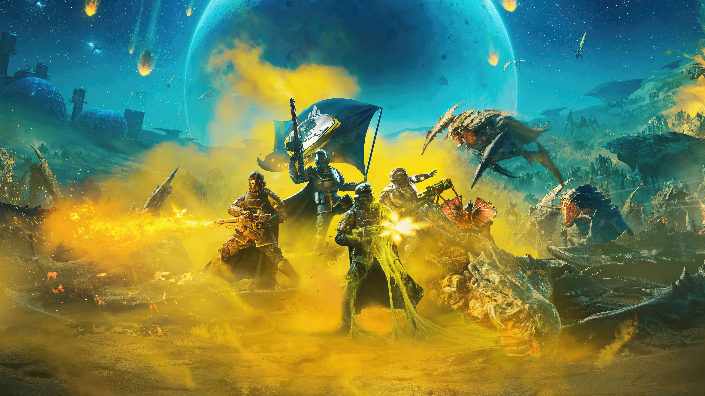

# A Helldivers 2 theme for the Nintendo 3DS



An extremely democratic Helldivers 2 theme for the Nintendo 3DS entertainment system.

- [A Helldivers 2 theme for the Nintendo 3DS](#a-helldivers-2-theme-for-the-nintendo-3ds)
  - [Get this theme](#get-this-theme)
    - [Using ThemePlaza](#using-themeplaza)
    - [Using local .zip file](#using-local-zip-file)
  - [Edit this theme](#edit-this-theme)
    - [Folder structure](#folder-structure)
  - [Palette](#palette)
  - [Tools \& links](#tools--links)

## Get this theme

### Using ThemePlaza

**T.B.A.**

### Using local .zip file

> [!NOTE]
> This guide assumes you have installed the [Anemone 3DS theme manager](https://wiki.hacks.guide/wiki/3DS:Anemone3DS).

Alternatively, you can also download the latest `.zip` file in the [release](./release/) directory and follow these steps:

1. Turn off your Nintendo 3DS.
2. Remove the SD card from your 3DS.
3. Read the SD card on a device that contains the downloaded `.zip`.
4. Move the `.zip` file over to your 3DS, it should go into the `./Themes` directory. This directory should be at the root of your SD card. Do **NOT** unpack the theme, it remain as a `.zip` file.
5. Remove the SD card from your device and put it back into the 3DS.
6. Turn on your 3DS.
7. Open Anemone 3DS Theme Manager.
8. You should now see the HELLDIVERS 2 theme.
9. Press A to install it
   1. Press 'UP' on the DPad to install it as is.
   2. Press 'LEFT' on the DPad to install only the background music.
   3. Press 'RIGHT' on the DPad to install the theme without background music.
   4. Press 'B' to cancel the installation :(
10. Profit.

## Edit this theme

> [!NOTE]
> This theme was built using `v1.3.1` of the Kame Editor, their [prerequisites](https://gitlab.com/beelzy/kame-editor/-/wikis/home#prerequisites) tab applies to this guide as well.

1. Clone this repository
2. Install the [Kame Editor](beelzy.gitlab.io/kame-editor/) into the root of the repository's directory.
3. Open the Kame Editor and load the theme into the editor.
4. Profit.

### Folder structure

```.sh
├───media
│   ├───images
│   │   ├───converted - Contains the converted (.rgb565) images & textures.
│   │   └───source - Contains the unconverted (.png & .jpeg) files.
│   └───sounds
│       ├───converted - Contains the converted (.bcwav & .bcstm) files used in the theme.
│       └───source - Contains the source (.wav) sound files used prior to conversion.
└───release - Contains all .zip exports of this theme.
```

## Palette

| Color                       | Hex value | Used as                       |
| --------------------------- | --------- | ----------------------------- |
| Democracy Yellow            | #FDE800   | Primary colour                |
| Dark Grey                   | #222323   | Secondary                     |
| Light Grey                  | #686868   | Accent                        |
| Democracy Yellow but darker | #887d00   | In 'pressed' state of buttons |

## Tools & links

- [Helldivers 2 quotes wiki](https://en.wikiquote.org/wiki/Helldivers_2)
- [Kame Editor Wiki](https://gitlab.com/beelzy/kame-editor/-/wikis/home#prerequisites)
- [Some Helldivers 2 sound clips](https://drive.google.com/drive/folders/1VT6HKNjR-lEG9xjQJB1dwWCI1ufyEFug)
